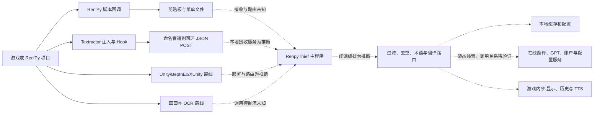

# RenpyThief 6.7.7 源码分析与 HanEngine 整合方案

> 范围说明：本文只分析 RenpyThief 这一特定参考材料，文中对 Ren'Py 的讨论是分析对象的事实，不定义 HanEngine 的产品范围。HanEngine 当前目标是通过统一适配器支持多个主流游戏引擎；请以项目根目录 `README.md` 和 `docs/project-status.md` 为准。

日期：2026-08-05

状态：静态分析定稿（三路分析与独立交叉复核通过）

## 1. 结论摘要

RenpyThief 6.7.7 不是一个单一的“Ren'Py 汉化器”，而是一个把多种文本获取和翻译路线统一在桌面应用中的兼容性编排系统。已恢复材料直接确认 Ren'Py 脚本回调和基于 Textractor 的通用进程注入/文本 Hook，并确认发行包含面向 Unity 的 BepInEx/XUnity 组件和 OCR 资源；Unity/OCR 的精确调用控制流仍未知。静态端点、导入和资源线索还表明主程序被设计为连接本地或在线翻译、缓存、配置、语音与更新能力，但闭源主程序内的精确调用关系尚未验证。

它最值得 HanEngine 借鉴的不是注入代码本身，而是三种产品和架构模式：

1. 多路线检测、失败回退和按游戏保存选择结果；
2. 把捕获端与翻译端隔离，通过统一消息边界传递文本；
3. 用候选文本预览、实时日志和可恢复配置降低兼容性排查成本。

不能直接整合的部分同样明确：进程注入、内存 Hook、管理员权限链路与当前 HanGuard 和 MVP 安全边界冲突；闭源主程序的伪代码、内存镜像、嵌入脚本和 UI 资源没有获得开源再许可；官方注入器是 Textractor 的 GPLv3 派生作品。若复制或链接后经个案判断构成 GPLv3 结合作品并对外分发，受覆盖整体须履行 GPLv3 第 5 条整体许可和第 6 条对应源码义务；独立进程、IPC 或聚合边界仍需结合部署与通信语义作法律判断。工程上当前禁止集成该链路，推荐采用“洁净室重实现 + 上游依赖独立治理”的方式，并且当前阶段不引入运行时注入能力。

## 2. 范围、方法与可信度

### 2.1 分析对象

- 原始归档：`C:\Users\23256\Documents\汉化\RenpyThief-6.7.7-authorized-recovered-source.7z`
- SHA-256：`2DF39E113C8CA2401749A2F985E00EB96F1FA2BC5FB82F47F77A3747EF67767A`
- 解包目录：`C:\Users\23256\Documents\汉化\RenpyThief-6.7.7-authorized-recovered-source`
- 归档内容：978 个条目；安全检查未发现绝对路径或 `..` 路径逃逸条目。
- 解包结果：892 个文件、88 个目录，约 903 MB。

### 2.2 安全方法

本次只进行静态分析：读取源码、伪代码、UI 描述、安装清单、字符串、哈希和许可证；没有运行主程序、注入器、Hook DLL、恢复脚本或归档内测试，没有连接其服务端，也没有对任何游戏进程进行注入。

### 2.3 证据等级

| 等级 | 含义 | 本报告中的用法 |
| --- | --- | --- |
| A | 官方公开源码或可直接审计的脚本 | 可确认控制流、接口和依赖 |
| B | 安装清单、UI XML、结构化运行时分析、文件清单 | 可确认打包内容和静态配置 |
| C | 反编译伪代码、可读字符串、恢复资源 | 只用于提出能力线索，不能单独证明运行时行为 |
| D | 根据多条静态证据形成的架构推断 | 明确标注为推断，后续需合法运行验证 |

恢复包自身也说明：只有 `injector-source/` 是可编译的官方公开源码；闭源原生模块只是 Ghidra C 风格伪代码，不等价于原始工程。因而本报告不会把伪代码中的函数名、控制流或字符串当作可直接复用的源码。

## 3. 软件架构解构

### 3.1 总体结构



这张图综合 A、B、C 级证据。脚本和 Textractor 的已确认链路用实线表示；Unity/OCR 的打包能力路径、主程序接收端及内部编排只用虚线表示静态推断。具体端点是否可达、在哪些模式启用以及最终如何显示仍需在合法环境中单独验证。

### 3.2 模块清单

| 模块 | 主要证据 | 技术实现 | 作用与边界 |
| --- | --- | --- | --- |
| 官方注入器 | `injector-source/` | C++20、Qt 5、Windows API、x86/x64 Hook DLL | 选择进程/Hook、接收文本、向本地主程序 POST JSON |
| 通用 Hook 引擎 | `injector-source/texthook/` | Textractor 引擎匹配、MinHook、命名管道、共享状态 | 覆盖大量旧式视觉小说和通用文本输出路径；高风险、Windows 专用 |
| 专有 Ren'Py 注入链 | `RenpyInject32/64.exe`、`RenpyHook32/64.dll` 的清单与恢复伪代码 | 命令参数、架构检查、远程 `LoadLibraryW`、按 PID 的共享映射/互斥体可见 | 与公开 Textractor 注入器不同；共享结构、消息 framing、取文点和译文回写均未知，不可复用 |
| Ren'Py 脚本桥 | `recovered-source/embedded-scripts/renpythief.rpy` | `config.all_character_callbacks`、包装 `renpy.exports.menu/say`、剪贴板、文件 | 捕获对话与菜单，未在该脚本中发现将译文写回正在显示文本的逻辑 |
| Unity 运行时组件 | `unpacked/{app}/trans/`、`install_script.iss` | BepInEx、XUnity.AutoTranslator、多架构/Mono 组件 | 继承第三方生态能力；不是 RenpyThief 独有实现 |
| OCR 资源 | `unpacked/{app}/models/`、`configs.txt` | 文件名指向 PP-OCR v3/v4 的 ONNX 模型与多语言字典；确切来源、转换链和逐模型许可未知 | 为无法可靠抓取文本的场景提供回退线索；部署体积大，禁止从恢复包复制模型 |
| 桌面主程序 | 主程序导入、可读字符串、资源 | Qt Widgets/Network/Sql/WebSockets/Multimedia | 可确认相关技术能力与功能线索；模式编排和服务调用关系为推断，闭源恢复物不可直接复用 |
| 本地数据 | 字符串与配置文件名 | SQLite、INI、JSON、缓存/备份文件 | 游戏配置、Hook 选择、历史或翻译缓存；完整 Schema 尚未从静态证据可靠重建 |
| 在线服务 | 可读 URL、路由字符串 | HTTPS/WSS、账户与翻译接口 | 显示云端配置和翻译能力线索；协议和隐私行为需合法动态验证 |

### 3.3 通用注入与文本传输链路

公开注入器源码确认以下流程的前四步；第 5 步明确标出静态材料仍无法闭合的边界：

1. 宿主创建 `TEXTRACTOR_HOOK` 和 `TEXTRACTOR_HOST` 命名管道。
2. 宿主打开目标进程，在目标进程中装载对应架构的 Hook DLL。
3. Hook DLL 捕获文本输出或引擎特定函数参数，经管道返回宿主。
4. 注入器过滤、合并文本，并通过 Qt Network 把 `{ "msg": ... }` POST 到 `127.0.0.1:<port>`。
5. **推断/未知边界：** 主程序静态资源显示本地 Server、翻译、显示和历史能力线索，但公开注入器源码只确认到回环 POST；接收服务与后续路由没有可审计函数体连接。

这个链路的架构优点是捕获端与产品主程序解耦、32/64 位分离、IPC 可观测；缺点是需要高权限并改变目标进程状态，容易触发安全软件或反作弊，并造成引擎版本、ABI 和 Hook 地址兼容负担。HanEngine 不应复制这一执行路线。

公开源码还揭示了几个影响可靠性的实现选择：`TextThread` 在发送前处理字符集、重复字符/句子和缓存刷新；UI 只转发用户选中的线程，多个来源用专用分隔符拼接。HTTP 发送端只有一个 `pendingText` 和单次 debounce 定时器，新文本会覆盖窗口内的旧值；响应只写调试日志，未发现请求序号、持久队列、幂等键或译文回传到 Hook 的代码。因而它适合“只关心最新屏幕文本”的即时翻译，却不能直接满足 HanEngine 对稳定 Segment、完整任务审计和可恢复批处理的要求。

引擎检测同样面向 Hook 成功率而不是资源语义：匹配器结合进程/文件/module 特征、内存范围、V8/Mono/Unity/Ren'Py 等分支，并在未命中时回退通用 GDI 路线。可见 Ren'Py 原生分支主要搜索 Python 2.x/UCS2 符号；现代 Ren'Py/Python 3 的原生 Hook 支持没有被公开源码证明。这类启发式和回退树可以指导测试分类，但不能直接转换成 HanEngine 的检测分数或“已验证可用”声明。

### 3.3.1 专有 Ren'Py 注入链（恢复伪代码）

恢复包还包含一条不能与公开 Textractor 注入器混同的专有路线：`RenpyInject32/64.exe` 接受 HTTP 端口、游戏类型、Hook DLL、游戏路径/命令行和 PID 等参数；伪代码可见架构检查、远程分配/写入、`CreateRemoteThread(LoadLibraryW)`，以及按 PID 区分的互斥体和共享映射对象。这里只能确认外围 API 和常量；共享结构、消息 framing、Hook DLL 的实际取文点、译文是否回传以及路线选择条件均未知。它属于未获开源再许可的恢复物，只能记录为架构证据，不能进入 HanEngine 代码、夹具或发布包。

### 3.4 Ren'Py 交互细节

恢复脚本在 `init python` 阶段安装桥接逻辑：

- 把回调追加到 `config.all_character_callbacks`，在角色对话事件中读取 `what`；
- 清理花括号文本标签和特定占位内容；
- 将 `RenpyThief:` 前缀、UTF-8 Base64 编码后的文本反转后写入 `pygame.scrap` 剪贴板；
- 包装 `renpy.exports.menu`，把菜单标签写入 `game/menu_items.txt`；
- 包装 `renpy.exports.say` 以保存最近一条文本，再调用原函数；
- 使用兼容 Python 2/3 的文件打开分支；剪贴板写入使用宽泛异常捕获以保持游戏继续运行，菜单文件写入失败则打印错误。

优势是实现短、依赖 Ren'Py 高层事件、对常见对话和菜单侵入相对小；局限包括：使用全局剪贴板、修改 `renpy.exports`、写游戏目录、没有稳定文本段 ID 和结构化上下文、剪贴板写入失败被静默吞掉，并且脚本本身主要解决“抓取”，没有证据表明它直接把中文替换进正在渲染的 Ren'Py 文本节点。

脚本还会删除所有形如 `{...}` 的内容，而不是对 Ren'Py 已知标签做结构化解析；这可能同时丢失格式信息、变量语义或本应保留的文本。Base64 再倒序只是可逆编码，不提供保密性。

对 HanEngine 的正确借鉴是使用官方支持的 Ren'Py 项目翻译工作流或对合法可访问的 `.rpy`/翻译目录进行静态解析与生成；不复制恢复脚本，不依赖剪贴板，不在成品游戏中猴子补丁内部导出函数。

### 3.5 资源与数据处理

安装清单显示 RenpyThief 把不同路线的运行时、模型、字体和许可证一并部署：

- Qt 运行库和主程序；
- x86/x64 注入器与 Hook DLL；
- Mono 与非 Mono 的 Unity/BepInEx/XUnity 组件；
- 中、英、繁中、日、韩、斯拉夫语系 OCR 模型和字符字典；
- 多个在线翻译端点插件、字体和语音辅助程序。

这一方案用部署体积换取开箱兼容性。对 HanEngine 而言，更合适的是将“标准库核心”和“大模型/引擎运行时”拆开：核心只保存提供方清单、哈希、能力与许可证；OCR 模型、Unity 插件等按需安装，并且必须来源于可验证的原始上游，而不是从恢复包重新分发。

### 3.6 用户界面与工作流

注入器的 Qt UI 以排障为中心：用户先点选游戏窗口，再在三列表格中查看候选来源和实时原文预览；内部 Hook 列在普通流程中被隐藏。候选支持多选组合，选择结果按游戏文件 SHA-1 保存；自动候选不够时，可输入当前画面的一段文字继续搜索并把结果加入主表。主程序静态资源还显示设置、OCR、GPT、历史、术语/自定义词、过滤、快捷键、语音和更新等入口。

值得借鉴的 UX 是“先展示证据，再保存已验证选择”和“实时反馈后台状态”。不应照搬的部分是要求普通用户理解 Hook 地址、Hook Code、架构和注入失败。HanEngine 应把候选 Hook 列表重构为 `RoutePlan`：展示检测到的引擎、证据、风险、允许操作、选定适配器、回退原因和成熟度；复杂技术细节只放在工作室模式的诊断页。

静态 UI 审查也发现不可继承的行为：部分表格/消息框控件被设为不可聚焦，缺少可验证的键盘与辅助技术路径；网络失败多停留在调试日志；一些失败提示只要求联系作者；关闭注入器还会终止目标游戏进程。HanEngine 的会话结束必须与游戏退出解耦，标准控件要保留焦点环、Tab/Enter/Space 路径，失败信息必须说明失败步骤、数据是否安全和可执行的下一步。

## 4. 技术优势与创新归因

### 4.1 值得保留的优势

| 优势 | 价值 | HanEngine 可采用的抽象 |
| --- | --- | --- |
| 多路线兼容 | 单一路线失败时仍可能通过其他方式取得文本 | AdapterV1 能力与成熟度、RoutePlan 回退链 |
| 捕获端与主程序解耦 | 不同位数、引擎和抓取机制可独立演化 | 统一 `SegmentEvent`/任务事件边界 |
| 游戏级配置记忆 | 一次排障后可自动复用 | 以游戏/项目指纹保存已验证适配器决策 |
| 候选文本实时预览 | 快速判断“抓到的是不是当前文本” | 证据预览、样本文本、置信度与诊断日志 |
| OCR 多语言注册表 | 模型、字典和语言映射清晰 | 可验证的 Provider Manifest 与按需模型包 |
| x86/x64 助手隔离 | 处理平台差异 | 仅在未来安全插件需要时采用进程外 helper 模式 |
| 本地缓存与 Unity 翻译文件 | 可减少重复翻译并支持人工修正 | HanStore 翻译记忆、术语表、来源与版本跟踪 |

### 4.2 创新归因边界

不能把所有能力都归因于 RenpyThief：

- 通用文本 Hook 主体明显继承 Textractor，官方注入器源码也声明是其 GPLv3 派生作品；
- Unity 自动翻译和缓存大量来自 XUnity.AutoTranslator/BepInEx 生态；
- MinHook 是独立 BSD 风格上游；
- OCR 模型属于其各自模型和框架的许可范围。

RenpyThief 自身的主要产品创新更接近“整合、自动选择、中文用户流程、翻译服务和多路线分发”。最终实现或宣传时应分别注明上游归属，避免把第三方技术描述成我方或 RenpyThief 的原创算法。

## 5. 与 HanEngine 当前项目的差距

以下内容是本报告对应提交时的历史快照，不代表当前实现状态：当时 HanEngine 仅具备本地 TXT/CSV/JSON/明文脚本字典替换、编码兼容、未翻译清单、Tkinter GUI，以及 Ren'Py、Unity、Unreal、Godot、RPG Maker 的只读目录结构检测。当前多引擎 AdapterV1、HanPipelineV1、HanTask、HanStore、HanGuard 和 Electron + React 状态应以 `README.md` 与 `docs/project-status.md` 为准。

| 维度 | RenpyThief 6.7.7 | HanEngine 当前状态 | HanEngine 目标优势 |
| --- | --- | --- | --- |
| 文本获取 | Hook、脚本、Unity、OCR 多路 | 明文文件 + 只读引擎检测 | 安全适配器 + OCR 视觉降级，路线可解释 |
| 翻译来源 | 本地/在线/GPT 等能力线索 | 本地 JSON 字典 | 可插拔 MT/LLM、术语、上下文、缓存 |
| 游戏内显示 | 多路线，部分依赖运行时组件 | 尚未实现 | 资源原生替换优先，受限场景原位置视觉替换 |
| 风险控制 | 未发现与 HanGuard 等价的强制策略 | 书面定义 H0–H3 | 所有操作经两阶段 RoutePlan 授权、风险只能升高 |
| 可回滚性 | 存在 `.bak` 字符串线索，完整事务证据不足 | 单文件输出不覆盖源文件 | 暂存构建、哈希清单、备份、原子安装、验证回滚 |
| 可观测性 | 实时候选预览、日志、保存 Hook | 基础控制台/GUI 日志 | HanTask 结构化进度、产物、重试、取消与恢复 |
| 可扩展性 | 多个工具和运行时集合，接口边界不完全开放 | Python ABC 检测器 | `hanengine.adapter/v1` 契约和统一契约测试 |
| 依赖/部署 | Qt/.NET/ONNX/BepInEx/多 DLL，体积大 | Python 标准库优先 | 核心轻量，重依赖作为按需、独立许可插件 |
| 合规 | 组件许可证混合，闭源主程序 | 仓库当前缺少根许可证 | 先定项目许可证，再做 SBOM、来源与分发门禁 |

## 6. 优势整合方案

### 6.1 整合原则

1. 复用接口思想，不复制闭源恢复物的表达形式。
2. 能从官方上游取得的依赖，只从官方上游固定版本和哈希获取。
3. 风险路线不得绕过 HanGuard；注入不是通用回退方案。
4. 核心保持 Python 标准库优先，重依赖用可选 Provider/Adapter 包隔离。
5. 每个适配器必须通过相同契约测试、黄金样本和回滚门禁后才能宣称“已验证可用”。

### 6.2 可复用决策矩阵

| 对象 | 决策 | 原因 | 推荐动作 |
| --- | --- | --- | --- |
| `injector-source/` | 不并入 MVP | GPLv3 派生、与无注入安全边界冲突 | 仅作研究证据；若未来启用，单独立项做安全与许可证评审 |
| Textractor Hook/引擎匹配 | 不复用代码 | GPLv3、进程注入、反作弊和维护风险 | 只借鉴“多候选 + 预览 + 保存选择”产品模式 |
| `renpythief.rpy` | 禁止复制 | 恢复资源没有开源授权，且接口脆弱 | 根据 Ren'Py 官方文档洁净室实现项目适配器 |
| 主程序伪代码/内存镜像 | 禁止复制 | 授权分析不等于再许可，且伪代码不可靠 | 只形成黑盒能力需求，不向实现代码复制结构或字符串 |
| UI XML、图标和文案 | 禁止复制 | 未确认独立开源许可 | 只采用通用 UX 原则，由 HanEngine 设计系统重新实现 |
| XUnity.AutoTranslator | 不作为 HanEngine 插件候选，仅作第三方研究与归因对象 | 已识别的 5.6.1 上游版本为 MIT，但常见集成依赖游戏进程内加载/Hook，与当前无注入边界冲突 | 不进入当前路线图；若未来产品边界改变，必须另立规格、安全评审和许可证评审 |
| MinHook | 许可证上可评估，产品上暂不采用 | BSD 风格许可宽松，但用途与安全边界冲突 | 不因许可证宽松而绕过 HanGuard |
| OCR 模型/字典 | 按模型逐项评估 | 模型、字典、框架可能分别持有不同许可证 | Provider Manifest 记录 URL、版本、哈希、许可证和模型卡 |
| 多路线编排、配置记忆、候选预览 | 洁净室重实现 | 属于通用架构/产品思想 | 映射到 RoutePlan、HanTask、HanStore、AdapterV1 |

### 6.3 目标模块映射

| 借鉴点 | HanEngine 落点 | 关键实现 |
| --- | --- | --- |
| Hook 候选预览 | `DetectionEvidence` + 诊断视图 | 预览引擎证据、样本文本、置信度、版本和限制，不展示 Hook 地址 |
| 保存游戏选择 | `HanStore.route_plans` | 键包含项目 UUID、可执行文件/源树指纹、适配器版本、规则库版本 |
| 本地 HTTP 消息边界 | `HanTask.event_sink`/进程外 Provider IPC | 首选进程内队列；必须跨进程时使用随机会话令牌、协议版本和仅回环绑定 |
| OCR 配置文件 | `ProviderManifest` | 语言、能力、文件哈希、许可证、最低硬件、置信度校准版本 |
| Unity 翻译缓存 | `TranslationMemory` | 缓存键加入项目 ID、源文本、上下文指纹、语言、提供方与模型配置 |
| 多引擎回退 | `RoutePlan.fallbacks` | 原生项目/资源适配器 → 官方模组接口 → 外部 OCR 视觉替换 → 保留原文/拒绝 |
| 实时注入器日志 | HanTask 任务中心 | 结构化 `queued/started/progress/warning/artifact/completed/failed` 事件 |

### 6.4 Ren'Py 适配器实现思路

HanEngine 的 Ren'Py 路线应面向用户拥有源码或明确授权的可访问项目：

1. `detect` 只读识别 `game/`、`.rpy`、Ren'Py SDK/项目标记和版本证据；只存在 `.rpyc`/`.rpa` 时停止于检测或报告不支持，不自动反编译/解包。
2. `extract` 使用语法感知的解析器或 Ren'Py 官方翻译生成能力，产出稳定 `SegmentDraft`：角色、标签、块位置、前后文、占位符和源指纹。
3. `validate` 检查文本标签、插值、转义、菜单结构、编码、重复 ID 和字体覆盖。
4. `build` 只在暂存目录生成标准 `game/tl/<language>/` 翻译文件或经批准的明文候选输出。
5. `verify` 对仓库自有 Ren'Py 基准项目执行语法检查和启动冒烟，不执行用户游戏作为自动验证样本。
6. 安装由 HanCore 创建备份和哈希清单后完成；失败按清单回滚。

这条路线提供真正的游戏内文本替换，同时避免运行时 Hook。对于只能看到编译归档的成品游戏，MVP 不承诺原生写回；HanGuard 选择外部原位置视觉替换或明确停止。

### 6.5 扩展接口建议

在现有 `hanengine.adapter/v1` 之外，后续只增加两个小接口，避免把 RenpyThief 的多套运行时耦合带入核心：

```text
TranslationProvider.translate(batch, context, terminology) -> ProviderResult
CaptureProvider.observe(window, regions) -> tuple[VisualSegment, ...]
```

两者都通过 HanTask 发事件，不直接访问 GUI 或 SQLite；Provider 元数据必须声明数据是否离开本机、所需依赖、许可证、支持语言、最大批次和取消能力。OCR/画面模块只能返回区域、文本与置信度，背景遮盖和同位置排版仍由独立视觉适配器处理。

## 7. 技术冲突、兼容性与解决方案

| 风险/冲突 | 影响 | 等级 | 解决方案 |
| --- | --- | --- | --- |
| GPLv3 注入器直接并入未定许可证仓库 | 若构成 GPLv3 结合作品并对外分发，受覆盖整体须按 GPLv3 第 5 条许可，并履行第 6 条对应源码义务；IPC/聚合边界需个案判断 | 阻断 | 先选择 HanEngine 根许可证；MVP 不引入该源码；由专业法律顾问审核任何未来组件边界 |
| 恢复伪代码/脚本没有再许可 | 侵权与来源污染风险 | 阻断 | 禁止复制；洁净室需求说明与实现分离；保存审查记录 |
| HanEngine 仓库无 `LICENSE` | 外部贡献者和用户没有明确授权 | 阻断 | 在第三方代码进入前确定并提交根许可证、贡献者声明和第三方通知策略 |
| 注入、内存 Hook、管理员权限与 HanGuard 冲突 | 反作弊、封号、崩溃、安全软件告警 | 阻断 | 保持禁止；在线/未知环境只允许外部捕获，H3 可完全拒绝 |
| Qt/C++/.NET/ONNX 与轻量 Python/Tkinter 栈冲突 | 安装包膨胀、打包和更新复杂 | 高 | 核心/GUI保持标准库；重组件做独立、按需 Provider 包 |
| Python 2/3 与 Ren'Py 版本差异 | 脚本回调、AST 和翻译格式变化 | 高 | 用固定 Ren'Py 8.5.3/8.4.1 基准，按版本声明适配范围；不猴子补丁内部导出 |
| 32/64 位及不同引擎 ABI | 运行时插件碎片化 | 高 | 优先文件级和官方模组接口；任何 helper 需按平台独立版本和协议测试 |
| 剪贴板作为 IPC | 泄露、竞争、编码和焦点问题 | 高 | 不采用；使用内存队列或带认证的本地 IPC |
| 无鉴权回环 HTTP | 本机其他进程可伪造或读取消息 | 高 | 默认进程内；跨进程使用随机令牌、长度限制、Schema 验证和协议版本 |
| 单槽 debounce 覆盖中间文本 | 快速对话、并发角色名/正文可能丢段，无法完整审计 | 高 | 每个 Segment 使用稳定 ID、单调序号和有界队列；拥塞必须产生可见事件，不能静默覆盖 |
| 宽松本地 IPC 权限/CORS 线索 | 扩大本机进程或网页来源的攻击面；现有证据不足以断言已可利用 | 高 | 最小权限 ACL、会话绑定、来源限制、消息大小上限和协议验证；上线前做威胁建模 |
| 在线服务和动态下载 | 隐私、供应链、服务失效 | 高 | 提供方显式同意、最小字段、TLS、固定来源/哈希、可离线回退；默认不上传截图 |
| OCR 模型许可和体积 | 分发合规、下载成本 | 中高 | 模型与代码分开打包，逐项 LICENSE/NOTICE/SBOM，首次使用再安装 |
| 自动替换误伤标签/占位符 | 游戏脚本损坏 | 高 | Segment 占位符模型、确定性校验、暂存构建、黄金样本、原子安装与回滚 |
| “检测成功”等同“支持汉化” | 用户预期错误 | 中 | 保持 `DETECT_ONLY → EXTRACT_READY → BUILD_READY → VERIFIED` 成熟度门禁 |

## 8. 开源与来源合规方案

### 8.1 当前结论

- `injector-source/` 随附 GPLv3 全文，源码头说明它是 Textractor 的 GPLv3 派生作品。保守起见，应按 `GPL-3.0-only` 处理，除非上游或权利人明确授予“或更高版本”。
- Textractor 官方仓库标为 GPL-3.0，并公开说明其 Host、Hook DLL、管道和扩展架构。
- XUnity.AutoTranslator 上游采用 MIT 许可证；若使用，应从上游获取而非从恢复包抽取。
- MinHook 上游采用 BSD 风格二条款许可证；许可证允许不代表产品安全策略允许其用途。
- Ren'Py 大部分采用 MIT，但其发行包包含不同许可证的依赖；适配器只应使用公开 API/格式并按实际分发内容审查。
- `recovered-source/LICENSE-NOTICE.md` 明确说明伪代码、内存镜像、清单和切出资源不是对闭源应用权利的授予。

以上是工程合规判断，不构成法律意见。

### 8.2 必须建立的门禁

1. 在 HanEngine 仓库根目录选择并提交 `LICENSE`；同步确定贡献者协议或 DCO 策略。
2. 新建 `THIRD_PARTY_NOTICES.md`，记录组件名、版本/提交、来源 URL、许可证、用途、修改和分发方式。
3. 生成 SPDX 或 CycloneDX SBOM；发布包 CI 对缺失许可证、未知来源和哈希漂移失败。
4. 对二进制、模型、字体和字典分别记录来源，不以父项目许可证代替子资产许可证。
5. 洁净室流程保留两类文档：分析员只写外部行为/接口需求，实现者只依据抽象规格编码；禁止复制恢复源码的注释、变量、UI 文案、图标或独特字符串。
6. 每个可选 Provider 独立展示隐私字段、网络行为和许可证；用户安装前确认。
7. 发布前由具备资格的法律人员复核 GPL 组件隔离、模型许可和游戏平台条款。

## 9. 实施路线图

### 阶段 0：许可与洁净室基线（先决条件，1 个迭代）

交付：根许可证决策、`THIRD_PARTY_NOTICES.md` 模板、SBOM 生成、恢复材料禁用清单、洁净室需求记录模板。

验收：CI 能阻止无许可证依赖；生产源码不包含恢复包路径、哈希以外的恢复资源；代码审查确认没有复制伪代码、脚本、UI 或文案。

### 阶段 1：完成 HanEngine Foundation（1–2 个迭代）

交付：按既有计划实现 Segment、AdapterV1 契约测试、两阶段 HanGuard、HanTask、项目隔离 HanStore 和 HanCore。

验收：80 个风险样本、适配器契约假实现、项目隔离、事件顺序/取消/重试测试全部通过；现有 99 项回归测试不退化。

### 阶段 2：洁净室 Ren'Py 项目适配器（2–3 个迭代）

交付：官方项目格式检测、`.rpy`/标准翻译目录提取、稳定 Segment、校验、暂存生成、哈希清单和合法基准冒烟。

验收：4 个仓库自有基准项目、500 个文本段；提取完整率和占位符保持达到主规格门槛；原项目在 build/verify 阶段保持只读；故障注入可完整回滚。

### 阶段 3：翻译记忆、术语与 Provider 路由（2 个迭代）

交付：本地字典迁移、项目级翻译记忆、术语锁定、MT/LLM Provider 接口、缓存和自动质量检查。

验收：离线字典路径保持可用；网络 Provider 默认只发送声明字段；缓存无跨项目污染；占位符/标签破坏会自动重试或保留原文。

### 阶段 4：安全 OCR 与原位置视觉替换（3 个以上迭代）

交付：按需 OCR Provider、窗口绑定、区域跟踪、背景遮盖、同坐标排版、动态场景降级和托盘交互。

验收：120 个静态案例、60 个动态序列；独占全屏/HDR/黑帧和 H3 风险正确停止；低置信度只保留原文，不降级成底部字幕；默认不落盘截图。

### 阶段 5：GUI 诊断与兼容性中心（1–2 个迭代）

交付：现有双模式 Tkinter 外壳接入 RoutePlan、任务中心、证据预览、异常清单、备份/回滚历史。

验收：普通玩家无需理解 Hook；工作室用户可查看引擎证据、适配器版本、成熟度、文件/文本进度、日志、重试与产物；切换模式不停止后台任务。

### 阶段 6：可选引擎插件评估（逐个立项）

Unity、RPG Maker、Godot、Unreal 等分别走文件级资源、官方本地化/模组 API 或完全外部视觉路线。当前路线图不接受 XUnity、BepInEx、Doorstop 或其他游戏进程内加载/Hook 组件成为 HanEngine 插件；如果未来要改变“无注入”边界，必须另立产品规格、策略契约、安全模型和许可评审，不能通过适配器配置绕过现有 HanGuard。

## 10. 决策记录

### 立即采用

- RoutePlan 的多路线和回退表达；
- 按项目/游戏指纹保存已验证选择；
- 实时候选证据、样本文本和任务日志；
- 捕获/翻译/存储/GUI 的消息边界；
- OCR 模型注册表思想，但重新定义来源与许可证字段。

### 延后评估

- Unity 的文件级资源与官方本地化/模组 API 适配器；XUnity 只保留为第三方研究与归因对象；
- 进程外 C++ helper（仅用于非注入、安全且 Python 无法满足性能的能力）；
- TTS 和语音代理；
- 云端账户、计费、配置与更新服务。

### 明确拒绝

- 将恢复伪代码、内存镜像、嵌入脚本、UI 资源或文案复制到 HanEngine；
- 把进程注入、内存 Hook、渲染 Hook、协议拦截作为玩家模式默认或回退路线；
- 对 `.rpa`、`.rpyc`、EXE 或受保护资源自动反编译、解包或写回；
- 以“检测到引擎”宣传为“已支持汉化”。

## 11. 证据索引与外部来源

### 本地恢复包

- `README-FIRST.txt`
- `recovered-source/README.zh-CN.md`
- `recovered-source/LICENSE-NOTICE.md`
- `recovered-source/embedded-scripts/renpythief.rpy`
- `injector-source/main.cpp`
- `injector-source/host.cpp`
- `injector-source/defs.h`
- `injector-source/RenpyThiefInjector.cpp`
- `injector-source/RenpyThiefInjector.ui`
- `injector-source/InjectorDialog.ui`
- `injector-source/HookResultWindow.ui`
- `injector-source/TextFinder.ui`
- `injector-source/CMakeLists.txt`
- `injector-source/LICENSE`
- `unpacked/install_script.iss`
- `unpacked/{app}/models/configs.txt`
- `recovered-source/runtime-analysis/selected-readable-strings.txt`
- `recovered-source/runtime-analysis/runtime-analysis.json`

### 关键结论定位

下列路径均相对解包目录，便于在不运行任何程序的前提下复核：

| 结论 | 证据位置 | 等级 |
| --- | --- | --- |
| 公开宿主创建管道并远程加载 Hook DLL | `injector-source/host.cpp:82-197`、`injector-source/defs.h:6-27` | A |
| 注入器把文本经回环 HTTP POST 给主程序 | `injector-source/RenpyThiefInjector.cpp:31-103` | A |
| 选择结果按游戏 SHA-1 保存和恢复 | `injector-source/RenpyThiefInjector.cpp:383-585` | A |
| 关闭注入器会终止目标游戏进程 | `injector-source/RenpyThiefInjector.cpp:587-590,996-1016` | A |
| 候选表、原文预览和保存工作流 | `injector-source/RenpyThiefInjector.ui:34-130`、`injector-source/RenpyThiefInjector.cpp:321-342,803-868` | A |
| Ren'Py 回调、剪贴板、菜单文件和 `say/menu` 包装 | `recovered-source/embedded-scripts/renpythief.rpy:30-86` | C |
| x86/x64、Unity、OCR 和模型资产进入安装包 | `unpacked/install_script.iss:39-42,64-117,135-242` | B |
| OCR 语言到模型/字典的分组 | `unpacked/{app}/models/configs.txt:1-41` | B/第三方 |
| 主程序含在线端点、本地服务、历史和翻译资源线索 | `recovered-source/runtime-analysis/selected-readable-strings.txt:1-117,444-521,900-997` | C；调用关系为 D |
| 恢复物不构成对闭源应用的重新许可 | `recovered-source/LICENSE-NOTICE.md:1-5` | B |

### 官方上游与文档

- Textractor 仓库与架构说明：<https://github.com/Artikash/Textractor>
- Textractor GPLv3：<https://raw.githubusercontent.com/Artikash/Textractor/master/LICENSE>
- XUnity.AutoTranslator：<https://github.com/bbepis/XUnity.AutoTranslator>
- XUnity.AutoTranslator 5.6.1 MIT：<https://github.com/bbepis/XUnity.AutoTranslator/blob/v5.6.1/LICENSE>
- MinHook 许可证：<https://raw.githubusercontent.com/TsudaKageyu/minhook/master/LICENSE.txt>
- Ren'Py 许可证文档：<https://www.renpy.org/doc/html/license.html>

## 12. 限制与后续验证

- 没有运行恢复软件，因而不能确认每个静态字符串对应的功能在 6.7.7 中是否可达或默认启用。
- 主程序受保护且只有伪代码，不能可靠恢复原始模块边界、类名、线程模型和数据库 Schema。
- `renpythief.rpy` 证明了文本抓取桥，但没有单独证明其完整“译文回显”链路；游戏内替换可能由主程序或其他组件完成。
- 在线端点、账户、更新和隐私行为只做了静态识别，没有发送请求。
- 任何第三方组件投入发布前，都必须重新从上游固定版本、核验哈希和许可证，并进行安全测试。

本报告因此适合作为 HanEngine 的架构和实施决策输入，不应被视为 RenpyThief 原始源码的完整重建，也不应替代专业法律意见或对目标游戏平台规则的逐项审查。
