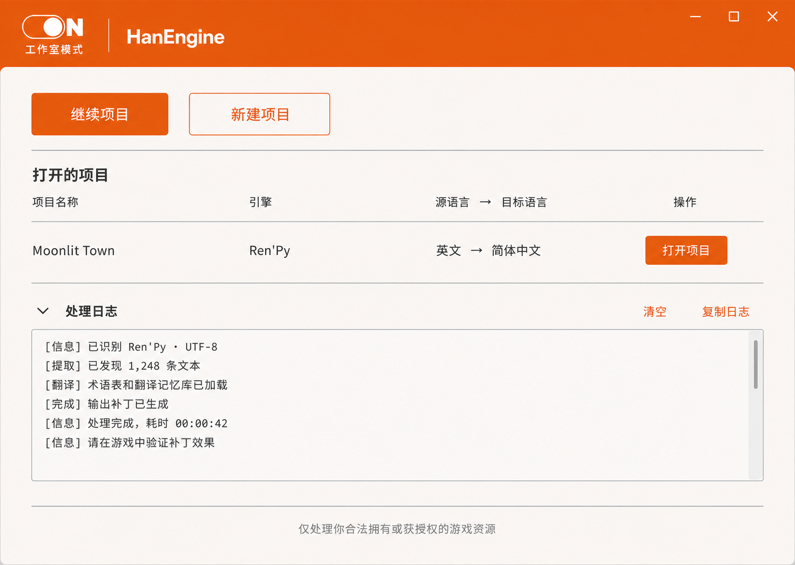

# HanEngine MVP 设计规格

日期：2026-08-05

状态：已按首轮书面审阅意见修订，等待最终审阅

## 1. 产品目标

HanEngine 是面向玩家、游戏开发者和汉化人员的本地优先游戏汉化引擎。它以“拖入成品游戏或打开项目”为入口，自动选择安全、可解释的汉化路线，并尽量减少逐条人工校验。

MVP 必须形成两个可运行闭环：

1. 玩家模式：对不能安全修改资源的游戏，在原文字位置完成视觉替换，而不是显示底部字幕。
2. 工作室模式：对 Ren'Py 项目完成检测、提取、翻译、校验、补丁导出和回滚。

两种模式共享统一文本段、翻译记忆、术语表、模型路由、任务系统和本地存储。HanEngine 首先作为可独立运行的无 GUI 引擎达到发布门槛，Tkinter GUI 是其薄客户端。

## 2. 安全与伦理边界

- 工具仅处理用户合法拥有或已获授权的游戏与资源。
- 不破解加密、DRM、压缩封装或游戏协议，不处理 EXE/SO 内部二进制文本。
- 检测到反作弊或高风险在线环境时，禁止进程注入、内存钩子、渲染钩子和协议拦截。
- 在线或多人游戏只有在官方模组接口或开发者明确授权时才允许资源替换；否则强制采用外部视觉替换。
- MVP 不包含绕过反作弊、规避平台检测或修改联网逻辑的能力。
- 原始文件默认只读。所有资源修改先在暂存副本中完成，并提供哈希清单和可验证回滚。

## 3. MVP 范围

### 3.1 包含

- Windows 10/11 优先的桌面应用；核心数据模型和工作室管线保持跨平台。
- OFF 玩家模式：白色主题、成品游戏入口、风险检测、原位置视觉替换。
- ON 工作室模式：橙色主题、Ren'Py 项目入口、补丁流程、实时任务中心。
- TXT、CSV、JSON 和 RPY 明文资源继续受支持。
- 本地字典、翻译记忆、术语表、缓存和自动质量控制。
- 可插拔在线机器翻译与 LLM 路由；断网时回退至本地能力。
- 引擎适配器成熟度和兼容性报告。

### 3.2 不包含

- 运行时注入或渲染钩子。
- 完整 HanCloud 计费、多人协作、账户系统和模型训练平台。
- TTS、语音克隆和自动配音。
- Ren'Py 以外引擎的写回承诺；现有 Unity、Unreal、Godot、RPG Maker 等检测能力只保留为检测基础。
- 对加密或专有封装资源的自动解包。

### 3.3 交付拆分

本文是 HanEngine MVP 的总设计，不对应一次超大实现提交。首个实现周期只交付第 12 节第 1–2 步的无 GUI 引擎基础；Ren'Py 原生替换、玩家视觉替换、模型路由和 GUI 分别进入后续实现周期。每个周期都必须保持前一周期测试通过，并在开始前形成独立实施计划；不得并行搭建尚无稳定核心接口的上层功能。

## 4. 用户体验

### 4.1 双模式外壳

- `OFF = 玩家模式 = 白色主题`，首次启动默认进入该模式。
- `ON = 工作室模式 = 橙色主题`。
- 模式开关位于左上角，支持鼠标、Enter 和 Space；必须同时显示文字标签，不能只用颜色传递状态。
- 切换模式只改变工作区，不中止后台任务。模式、窗口状态和最近项目会被记住。
- 两种模式共享任务、翻译记忆、术语表、模型配置和历史记录。

### 4.2 最终视觉目标

工作室模式视觉约束：

- 橙色顶栏高度约 96–112 px，不作为大幅品牌展示区。
- 开关与 ON 文本总宽约 108–120 px、高约 40–44 px；HanEngine 字标约 32–38 px。
- 主要内容使用暖白工作区、深色文字、橙色主操作和细分隔线。
- 日志区域可折叠，展开时仍不得压缩项目主要操作。
- 除标准控件外不使用紫色、霓虹、玻璃拟态、复杂渐变、嵌套卡片或装饰性游戏图片。

### 4.3 玩家模式

用户拖入游戏或选择游戏窗口后，HanEngine 先展示处理路线和风险级别，再启动任务。支持的、已验证引擎可使用资源替换；其他情况使用原位置视觉替换。低置信度文本保留原文，不退化为底部字幕。

#### 4.3.1 窗口与显示支持

- 支持 Windows 10/11 的普通窗口化和无边框全屏，一次只绑定一个游戏窗口。
- MVP 不支持独占全屏；检测到独占全屏时要求用户切换至窗口化或无边框全屏。
- MVP 基准只覆盖 SDR。HDR、受保护内容或返回黑帧的窗口会停止视觉替换并给出明确原因。
- 游戏最小化、被系统隐藏、关闭或切换出所选窗口时，翻译层在 100 ms 内隐藏并暂停捕获。
- 窗口移动、缩放、分辨率改变或跨显示器移动时，先清除旧区域，再重新校准坐标；校准完成前不绘制译文。
- 支持同一显示器上的系统缩放；混合 DPI 跨屏移动必须重新校准。远程桌面和虚拟机不属于 MVP 验收范围。

#### 4.3.2 运行时交互

1. 用户选择游戏窗口后，预检页显示窗口缩略图、窗口模式、风险等级、捕获能力和预计替换路线。
2. 启动后主程序可最小化到系统托盘；游戏上方只保留点击穿透的替换层，不显示工具条或底部字幕。
3. 默认快捷键为 `Ctrl+Alt+F8`（显示/隐藏替换）和 `Ctrl+Alt+F9`（暂停/继续识别），均可重新绑定。
4. 窗口失焦时默认隐藏替换层；用户可在低风险离线项目中选择“失焦时保持”，该选项不得用于高风险环境。
5. 当前窗口、捕获状态、OCR/翻译延迟和降级原因持续发送到 HanTask；用户可从托盘返回任务中心。
6. 结束会话后保留翻译记忆和脱敏事件，不保留原始截图；用户可导出或删除该会话数据。

### 4.4 工作室模式

用户打开 Ren'Py 项目后，HanEngine 自动完成检测、文本提取、上下文构建、翻译、自动校验、暂存写入、补丁导出和合法样本的启动冒烟验证。异常条目进入异常清单，不要求用户逐条审核全部文本。

## 5. 系统架构

### 5.1 HanShell

Tkinter 双模式桌面外壳。只负责输入、视图、任务控制、日志和状态呈现。耗时工作不得在 Tkinter 主线程执行。

### 5.2 HanCore

统一文本处理核心。它接收适配器产生的文本段，依次执行规范化、去重、上下文构建、翻译路由、质量检查和输出编排。CLI、GUI 和未来服务端均只通过公开接口调用它。

### 5.3 HanAdapters

适配器必须使用同一契约：

- `detect`：给出引擎、证据、置信度和风险信号。
- `extract`：产生统一文本段和稳定来源位置。
- `validate`：检查翻译、格式、编码和占位符。
- `build`：只向暂存目录生成候选输出。
- `verify`：检查输出语法、文件清单和可启动条件；对测试语料执行实际启动冒烟验证。
- `rollback`：根据清单恢复并验证原文件哈希。

MVP 的工作室适配器为 Ren'Py；玩家侧适配器为屏幕捕获、OCR、区域跟踪、背景遮盖和同位置文字重绘。

所有数据结构、操作输入输出、错误码、不变量和成熟度晋级规则以 [HanEngine 适配器接口契约 v1](2026-08-05-hanengine-adapter-contract.md) 为准。实现开始前，该契约的测试骨架必须先于具体适配器建立。

### 5.4 HanContext

管理翻译记忆、术语表、角色名、前后文、重复句和项目规则。它向翻译提供结构化上下文，但不与具体翻译服务绑定。

### 5.5 HanRouter

按以下顺序路由：

1. 精确字典和翻译记忆。
2. 术语锁定与重复句复用。
3. 神经机器翻译。
4. 仅对低置信度、歧义句、长对话或重要剧情调用 LLM 上下文优化。
5. 规则校验失败时使用严格提示重试，再切换备用提供方。

提供方通过插件式接口接入，可使用 HanCloud、用户自带密钥或自托管模型。默认只向在线提供方发送必要文本与上下文，不上传游戏截图。

### 5.6 HanGuard

在任何修改前生成 `RoutePlan`。HanGuard 是所有适配器的强制入口；风险只允许升高，不能被适配器或用户配置降低。

风险等级与权限：

| 等级 | 典型场景 | 允许操作 |
| --- | --- | --- |
| `H0_PROJECT` | 用户拥有源码的项目或仓库自有基准项目 | 只读检测、提取、暂存构建、补丁安装、外部视觉替换 |
| `H1_OFFLINE` | 已验证适配器支持的离线成品游戏，未发现保护信号 | 只读检测、经清单保护的资源补丁、外部视觉替换 |
| `H2_RESTRICTED` | 在线/多人游戏、政策未知、适配器或版本未知 | 仅操作系统级画面捕获、OCR 和点击穿透视觉替换；禁止写游戏目录 |
| `H3_PROTECTED` | 检测到反作弊、受保护进程、明确的覆盖层禁令或捕获黑帧 | 禁止资源修改、注入、钩子和内存访问；只有不存在覆盖层禁令且操作系统允许正常画面捕获时才提供外部视觉替换，否则拒绝启动 |

检测逻辑按以下顺序收集非侵入式证据：

1. 用户声明的在线/离线、多人属性和授权类型。
2. 适配器检测到的项目清单、官方模组入口、引擎标记和已验证版本。
3. 安装目录中公开可见的反作弊文件名、服务清单和启动器清单。
4. 操作系统公开的进程名和服务名，不枚举模块、不读取进程内存。
5. 版本化的 HanGuard 规则库；每条规则记录来源、版本、最后验证日期和命中证据。

每条 `HanGuardRule` 必须包含：稳定规则 ID、规则版本、信号类型（用户声明、路径、清单键、进程名、服务名或捕获结果）、大小写归一化匹配值、最低风险等级、禁止操作、理由、证据来源和最后验证日期。决策算法先计算用户声明基线和适配器基线，再收集规则命中，最终风险取所有结果中的最高等级，允许操作取所有命中规则允许集合的交集。`RoutePlan` 必须保存规则 ID、实际信号、决策前后风险和最终允许/禁止操作。

评估分两阶段，避免 HanGuard 与适配器相互依赖：第一阶段只使用用户声明和环境信号生成临时风险，只开放只读 `detect`；适配器返回引擎证据后，第二阶段合并适配器基线并生成最终 `RoutePlan`。`extract` 及之后的所有操作只能使用最终路线计划。

规则冲突时采用最高风险。证据缺失、规则库未知或检测异常时默认 `H2_RESTRICTED`，不得默认安全。资源补丁开始前还必须确认目标游戏未运行；运行中风险升高时立即停止新操作、清除视觉替换并记录原因。HanGuard 在启动时评估，并在玩家会话中每 5 秒重新评估公开的进程/服务信号。`H3_PROTECTED` 不能由用户强制覆盖。

### 5.7 HanTask

把后台工作表达为计划、步骤、事件和产物。任务中心实时显示：

- 等待、执行中、已完成、暂停、重试、失败和取消状态。
- 当前文件、已处理数量、总量、耗时、翻译来源和重试次数。
- 暂停、继续、取消、失败步骤重试、复制日志和打开输出目录操作。
- 切换模式后继续显示的全局任务摘要。

任务事件使用结构化类型：`queued`、`started`、`progress`、`log`、`warning`、`retrying`、`artifact`、`completed`、`failed` 和 `cancelled`。GUI 批量读取事件，限制刷新频率，防止高频日志阻塞界面。日志不记录 API 密钥、完整服务请求或模型内部推理。

### 5.8 HanStore

SQLite 保存项目、文本段、翻译记忆、术语、路线计划、任务、步骤、事件、产物和检查点。JSON 继续作为字典、术语表和异常清单的可读交换格式。

数据按项目 UUID 隔离：

- 全局配置数据库：`%LOCALAPPDATA%/HanEngine/config.db`，只保存非敏感设置、适配器元数据和项目索引。
- 项目数据库：`%LOCALAPPDATA%/HanEngine/projects/<project_id>/hanengine.db`。
- 项目缓存、会话事件、异常清单和产物均位于同一项目根目录下的独立子目录。
- 翻译记忆和术语表默认仅限项目；用户必须显式导入或启用“用户全局库”才能跨项目复用。
- 缓存键必须包含项目 ID、源文本、上下文指纹、目标语言、提供方和模型配置，防止跨项目污染。
- API 密钥存入 Windows Credential Manager，不进入 SQLite、JSON、日志或项目导出包。
- 删除项目时分别提供“仅从列表移除”和“删除全部本地数据”；后者必须列出将删除的数据并二次确认。

### 5.9 HanCloud

MVP 只定义认证、翻译、上下文优化和健康检查接口。完整账户、计费、协作、TTS 和模型训练属于后续独立项目。

## 6. 核心数据模型

### Segment

至少包含：稳定 ID、原文、译文、源语言、目标语言、说话人、前后文、占位符、标签、来源文件、来源位置、屏幕区域、来源置信度、翻译置信度、提供方、状态和版本。

### RoutePlan

包含：检测到的引擎、证据、运行环境风险、选定路线、允许操作、禁止操作、适配器成熟度、置信度、回退路线和用户可读说明。

### TaskPlan / TaskStep / TaskEvent / Artifact

任务计划包含有序步骤与安全检查点；事件描述实时状态变化；产物保存输出路径、哈希、类型、创建步骤和回滚关系。

## 7. 混合替换策略

### 7.1 真实资源替换

仅在适配器达到“已验证可用”、资源可访问、风险检查通过且使用行为被授权时启用：

`检测 → 提取 → 翻译 → 自动校验 → 暂存构建 → 语法/编码检查 → 补丁导出`

默认不直接覆盖游戏目录。若用户明确选择安装补丁，安装前创建清单和备份，安装后验证哈希与目标文件。

### 7.2 原位置视觉替换

用于无法安全修改资源的游戏：

`画面捕获 → 本地 OCR → 文本区域跟踪 → 去重/上下文 → 翻译 → 背景遮盖 → 同坐标中文排版`

实现为游戏进程外的点击穿透窗口。它不得注入游戏，也不得读取或修改游戏内存。只有文本定位、翻译和遮盖置信度均达到阈值时才绘制；否则保留原文。

OCR 通过提供方接口隔离。Windows MVP 优先使用可本地运行的 OCR 提供方；若系统中没有满足基准门槛的本地提供方，玩家模式必须明确报告不可用，而不是静默上传截图。

动态场景使用稳定度分数 `S = 0.4 × 文本框 IoU + 0.3 × OCR 文本稳定度 + 0.3 × 背景稳定度`：

- `S ≥ 0.85` 且连续 3 帧成立：允许遮盖并绘制译文。
- `0.65 ≤ S < 0.85`：最多等待 250 ms 重新判定；等待期间保留原文。
- `S < 0.65`、大幅镜头运动或无法重建背景：立即移除旧译文并保留原文。
- 打字机文本在字符 180 ms 未变化或句末稳定后再翻译；源文本指纹改变时，旧译文必须在 100 ms 内失效。
- 只有纯色/半透明对话框、可复用干净帧或能可靠采样的背景允许遮盖。直接绘制在高速动画世界上的文字默认不替换。
- 降级只允许“等待、隐藏译文、保留原文”，不得转为底部字幕。

### 7.3 禁止路线

MVP 不实现运行时渲染钩子。即使未来增加，也必须作为离线、无反作弊、显式授权的独立适配器，不能成为通用回退路线。

## 8. 自动质量控制

HanEngine 不设置强制逐条人工审核步骤。自动检查包括：

- 占位符、变量、标签、转义序列和换行保持。
- 文件编码、JSON/CSV/RPY 语法和写回结构。
- 角色名、术语和重复文本一致性。
- 目标文本长度、文本框适配和中文字体覆盖。
- OCR 置信度、区域稳定性、背景遮盖质量和渲染裁切。
- 翻译来源、置信度、重试、回退和版本追踪。

通过检查的内容自动采用；普通警告不中止任务。无法安全处理的内容保留原文并写入异常清单。开发阶段使用人工确认的黄金样本调教引擎，但普通用户不需要执行全量人工校验。

### 8.1 异常清单流程

异常项包含：项目 ID、文本段 ID、来源位置、原文、候选译文、问题码、严重度、自动尝试记录、当前处理方式和审计记录。

严重度与默认行为：

- `CRITICAL`：安全策略、路径逃逸、格式损坏、占位符丢失或数据丢失风险；阻止补丁安装。
- `ERROR`：单条内容无法安全写回；该条保留原文，其他条目可继续构建候选补丁。
- `WARNING`：可自动采用但需要记录，例如长度接近上限。
- `INFO`：提供方回退、缓存命中等审计信息，不进入默认异常视图。

处理顺序固定为：规则自动修复 → 同提供方严格重试 → 备用提供方重试 → 保留原文 → 写入异常清单。玩家模式不弹窗打断游戏，只在会话异常清单记录；工作室模式在安装补丁前只要求处理 `CRITICAL`。

用户可对异常执行：重试、编辑译文并重新校验、接受保留原文、加入术语表后重跑受影响文本、忽略警告、导出 JSON。任何操作都会重新运行相关校验并追加审计事件。状态只能在 `OPEN`、`AUTO_RETRYING`、`SOURCE_KEPT`、`RESOLVED` 和 `WAIVED` 之间按规则转换；`CRITICAL` 不允许直接 `WAIVED`。

## 9. 错误处理与恢复

- 适配器失败：回滚整个候选输出，不留下部分修改，并建议安全回退路线。
- 在线服务失败：依次回退至缓存、翻译记忆和本地字典；仍无结果则保留原文。
- 占位符或格式损坏：严格规则重试，随后切换备用提供方；仍失败则进入异常清单。
- OCR 或遮盖置信度不足：不绘制译文，不显示底部字幕。
- 程序异常退出：从 SQLite 检查点恢复可恢复步骤；不可恢复步骤明确标记并允许重试。
- 用户取消：完成当前不可分割写入后停止，并确保暂存目录和原文件处于一致状态。

### 9.1 备份与回滚用户流程

1. 安装补丁前展示文件数量、预计备份大小、目标目录、磁盘空间和风险等级。
2. HanCore 在 `%LOCALAPPDATA%/HanEngine/backups/<project_id>/<timestamp>/` 创建内容备份、安装清单和 SHA-256 哈希；备份成功前不得写目标目录。
3. 安装采用同目录临时文件加原子替换；每完成一个不可分割步骤都更新清单。
4. 项目页提供“恢复上次版本”和“选择历史备份”。恢复本身也是 HanTask 任务，实时显示文件和哈希验证。
5. 默认每个项目保留最近 5 份且不超过 30 天；用户固定的备份永不自动删除。清理只删除清单确认属于 HanEngine 的备份目录。
6. 回滚失败时保持全部备份不变，停止后续清理，并生成包含失败路径和预期/实际哈希的恢复报告。
7. 玩家视觉替换不修改游戏文件；停止会话或隐藏替换层即完成回滚。

## 10. 兼容性成熟度

每个适配器只有四种对外状态：

`仅检测 → 可提取 → 可生成补丁 → 已验证可用`

检测成功不得被描述为汉化支持。只有通过该引擎全部发布门槛的版本组合才能显示“已验证可用”。兼容性报告必须包含引擎版本、样本证据、已知限制和最近验证日期。

## 11. 测试与发布门槛

保留现有 99 项测试，并增加：

- Segment、RoutePlan、翻译路由、占位符保护和任务事件单元测试。
- 每个适配器的统一契约测试和黄金样本测试。
- TXT、CSV、JSON、RPY 及 UTF-8、UTF-8 BOM、Shift-JIS 编码回归测试。
- 固定截图上的 OCR、区域跟踪、遮盖、字体覆盖和中文排版测试。
- 合法 Ren'Py 示例项目的检测、提取、翻译、补丁、实际启动冒烟验证和回滚端到端测试。
- 反作弊安全测试，证明高风险环境永远不能进入注入、内存钩子或协议拦截路径。
- GUI 模式开关、主题恢复、任务刷新、暂停、取消和重试测试。

### 11.1 固定基准测试集

所有基准资产由本仓库生成和维护，附带来源清单与 CC0-1.0 测试资产声明，不下载或提交第三方商业游戏内容。

Ren'Py 基准包含 4 个项目、共 500 个带稳定 ID 的预期文本段：

| 项目 | 预期文本段 | 覆盖内容 |
| --- | ---: | --- |
| `rp_core_dialogue` | 160 | 旁白、角色对话、菜单、插值、转义、文本标签、暂停和换行 |
| `rp_screen_language` | 120 | screen language、按钮、提示、样式、字体大小和条件文本 |
| `rp_branching_context` | 120 | label、call、jump、条件分支、角色上下文和重复句一致性 |
| `rp_packaged_smoke` | 100 | 可分发最小游戏、补丁安装、启动标记、存档隔离和回滚 |

每个项目提交预期文本段 JSON、源树哈希、补丁后哈希、启动冒烟断言和回滚哈希。本规格固定测试 Ren'Py 8.5.3 和 8.4.1；`rp_packaged_smoke` 必须分别由这两个 SDK 构建并验证。版本依据为 [Ren'Py 8.5.3 官方发布页](https://www.renpy.org/release/8.5.3)和[官方发布列表](https://www.renpy.org/release_list.html)。版本范围变化必须修订规格并生成新的兼容性报告。

翻译质量黄金集 `translation_gold.json` 固定为 300 条人工确认参考：180 条剧情对话、60 条菜单/UI、60 条系统提示，源语言同样按 80% 英文、20% 日文分层。每条包含角色、前后文、术语、实体/数字/否定标记、允许的参考译文和禁止错误。

HanGuard 基准 `guard_risk_cases.json` 固定为 80 个合成环境快照：`H0`、`H1`、`H2`、`H3` 各 16 个，另有 16 个规则冲突、证据缺失或检测异常案例。所有案例保存输入信号、命中规则、预期风险和允许/禁止操作，不包含真实商业游戏文件。

玩家模式基准包含：

- 120 张静态截图：4 种分辨率（1280×720、1920×1080、2560×1440、3840×2160）× 5 种背景（纯色框、半透明框、纹理框、静态场景、低对比场景）× 3 种布局（单行、多行、菜单）× 2 种字体轮换组合，按正交采样组成 120 个唯一案例。
- 60 段动态序列，每段 30 帧：打字机、淡入/滑动、动画背景和镜头移动各 15 段。
- 文本来源按 80% 英文、20% 日文分层；目标文本全部为简体中文，并提供字符真值、文本框真值、允许遮盖区域和预期降级结果。
- 窗口矩阵覆盖普通窗口、无边框全屏、最小化、移动、缩放、跨 DPI 显示器重新校准、黑帧和 HDR 拒绝路径。

性能基准机最低规格固定为 Windows 11、4 个物理核心/8 个逻辑线程、16 GB 内存、1920×1080 SDR，不要求独立显卡；报告必须记录实际 CPU、GPU、系统版本和 OCR 提供方版本。

### 11.2 量化验收指标

适配器或玩家替换管线标记为“已验证可用”前必须满足：

- Ren'Py 支持范围内文本提取覆盖率 100%，500 个预期文本段无缺失、无额外误提取。
- 变量、标签和占位符保持率 100%；所有基准项目连续执行 20 次补丁、语法检查和实际启动冒烟验证无失败。
- 回滚后原始文件 SHA-256 完全一致，备份/恢复失败案例的数据丢失数为 0。
- 重复文本翻译一致率不低于 98%，指定术语遵守率 100%。
- 静态截图 OCR 总字符准确率不低于 95%，英文和日文各自不低于 93%。
- 文本框检测召回率不低于 95%、精确率不低于 98%；动态跟踪的第 90 百分位 IoU 不低于 0.85。
- 至少 95% 的基准文本框完成无裁切中文排版；字体缺字导致的空白方框为 0。
- 在允许遮盖的静态/低动态案例中，原文字形残留像素不超过真值字形区域的 1%，背景重建 SSIM 不低于 0.90。
- 动态场景中旧译文在源指纹变化、失焦或最小化后 100 ms 内隐藏；预期降级案例错误遮盖数为 0。
- 缓存命中后的替换延迟第 95 百分位低于 100 ms；本地捕获、OCR 和排版总开销第 95 百分位低于 500 ms，不计在线服务网络等待。
- HanTask 进度事件到 GUI 的显示延迟第 95 百分位低于 200 ms；取消请求在非原子阶段 2 秒内确认。
- HanGuard 的全部 `H3_PROTECTED` 基准信号必须被识别，错误判为 `H0/H1` 的数量为 0；未知证据必须得到 `H2_RESTRICTED`。
- 翻译黄金集的实体、数字、否定和指定术语保持率为 100%；两名开发阶段审阅者独立评分后，至少 95% 条目的语义准确度与中文流畅度均达到 4/5，严重意义反转为 0。
- 低置信度与失败情况保留原文，不显示底部字幕，不产生错误遮盖。
- 全部契约测试、现有 99 项回归测试及新增端到端测试通过。

## 12. 实施顺序

1. 建立适配器契约测试骨架、HanGuard 风险样本、4 个 Ren'Py 基准项目清单和玩家截图生成清单。
2. 建立无 GUI 的 HanCore、Segment、RoutePlan、HanTask 和 HanStore。
3. 迁移现有明文翻译、编码处理、扫描器和检测器，保持现有测试通过。
4. 调教 Ren'Py 适配器直至达到“已验证可用”。
5. 生成固定截图/动态序列基准，建立视觉替换管线，调教 OCR、区域跟踪、遮盖和排版。
6. 接入翻译记忆、术语表、机器翻译和 LLM 分层路由。
7. 接入已确认的 Tkinter 双模式外壳和实时任务中心。
8. 只在本地闭环稳定后定义 HanCloud 的首个服务实现。

任一阶段不得为了展示 GUI 而绕过对应的引擎发布门槛。

## 13. MVP 完成定义

MVP 完成必须同时满足：

- 玩家模式能够对基准游戏画面执行安全的原位置视觉替换，不使用底部字幕。
- 工作室模式能够对基准 Ren'Py 项目完成可回滚的原生资源汉化闭环。
- 翻译记忆、术语表、自动校验和异常清单在两种模式间共享。
- 任务中心能够实时显示计划、步骤、日志、重试、产物和恢复状态。
- 所有安全约束、质量门槛和回归测试通过。
- 现有明文处理能力不退化。

## 14. 合规声明与隐私提示

### 14.1 用户确认

- 首次启动显示一次简明声明：仅处理用户合法拥有或获授权的资源，不提供破解、DRM 绕过、反作弊规避或联网协议修改。
- 每个新项目记录授权类型：`本人开发`、`已获开发者授权`、`合法拥有的个人本地化使用`。未确认时只允许浏览说明，不能启动任务。
- 在线/多人游戏额外提示平台规则可能禁止资源修改；HanEngine 在无官方模组接口时强制使用外部视觉替换，但这不构成平台合规保证或法律意见。

### 14.2 数据处理

- 截图、OCR 中间图、背景遮盖样本默认只存在内存，调试落盘必须由用户显式开启并显示保留期限。
- 在线提供方默认只接收源文本、必要前后文、语言和术语约束；发送前显示提供方名称和数据字段。截图上传默认禁止。
- API 密钥使用 Windows Credential Manager。日志、异常清单、项目导出和崩溃报告必须脱敏。
- 遥测默认关闭。崩溃报告必须单次确认，并允许用户在发送前预览脱敏内容。
- 隐私页提供项目数据导出、会话删除、缓存清理、凭据删除和全部本地数据清除。
- 本地事件默认保留 30 天；项目翻译记忆和术语表保留至用户删除项目或明确清除。

## 15. 补完优先级与开发门禁

### 15.1 最高优先级：实施计划前置条件

- 第 4.3.1 节明确了窗口模式和显示限制。
- 第 7.2 节明确了动态场景稳定度和降级策略。
- 第 5.6 节明确了 HanGuard 四级风险、证据来源、从严规则和复检逻辑。
- 第 11 节明确了 Ren'Py/截图基准集、参考硬件和全部量化指标。

这些内容经用户书面审阅确认后才能编写首个实施计划。实施计划的第一批任务必须先创建基准资产清单、风险样本和契约测试骨架，再编写生产代码。

### 15.2 高优先级：相关模块编码前置条件

- [适配器接口契约 v1](2026-08-05-hanengine-adapter-contract.md) 必须先转化为契约测试，具体适配器随后实现。
- 第 8.1 节异常清单流程必须先形成状态机测试，补丁安装界面随后实现。
- 第 4.3.2 节玩家运行时交互必须先形成窗口状态和快捷键测试，视觉替换层随后实现。

### 15.3 中优先级：进入 GUI 集成前完成

- 第 5.8 节项目隔离必须先形成数据库路径、作用域和删除测试。
- 第 9.1 节备份/回滚必须先通过磁盘不足、部分失败、固定备份和哈希恢复测试。
- 第 14 节合规与隐私文案、同意记录、数据导出和删除流程必须在 GUI 集成前完成。
